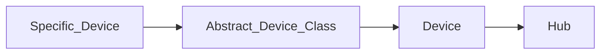

# Hubitat Elevation Maker API Interface (with Requests)


[](https://libraries.io/pypi/hubitatcontrol)


[](https://python-poetry.org/)
[](https://badge.fury.io/py/hubitatcontrol)


[](https://www.python.org)


## Usage
```shell
pip install hubitatcontrol
```

```python
import hubitatcontrol as hc

hub = hc.get_hub(host='Hubitat_IP_or_Hostname', token='Maker_Token', app_id='Maker_App_ID')
device = hc.lookup_device(hub, 'Device_Name')

print(device.switch)
device.turn_on()
print(device.switch)
```

## Roadmap
### v0.5
- [X] Advanced Zigbee RGBW Bulb
### v0.7
- [X] Generic Zigbee Outlet
### v0.8
- [X] Leviton DZ6HD Z-Wave Dimmer
### v1.0
- [ ] hueBridgeBulb
### v1.1
- [ ] hueBridgeBulbCT
### v1.2
- [ ] hueBridgeBulbRGBW
### v1.5
- [ ] Ecobee Thermostat
### v2.0
- [ ] Generic Z-Wave Lock
### v2.5
- [ ] Generic Z-Wave Plus Scene Switch
### v2.6
- [ ] Generic Zigbee Contact Sensor (no temp)
- [ ] Sonoff Zigbee Button Controller

## Structure



## Development setup
Testing is done with PyTest, you will need to set up the correct env vars for your local (or cloud) Hubitat API
See `.env.example`

**Setup**

Install Go-Task --> <https://taskfile.dev/installation/>

```shell
task setup
task
```
