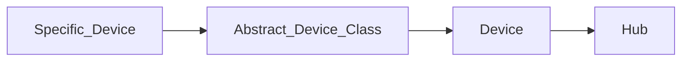
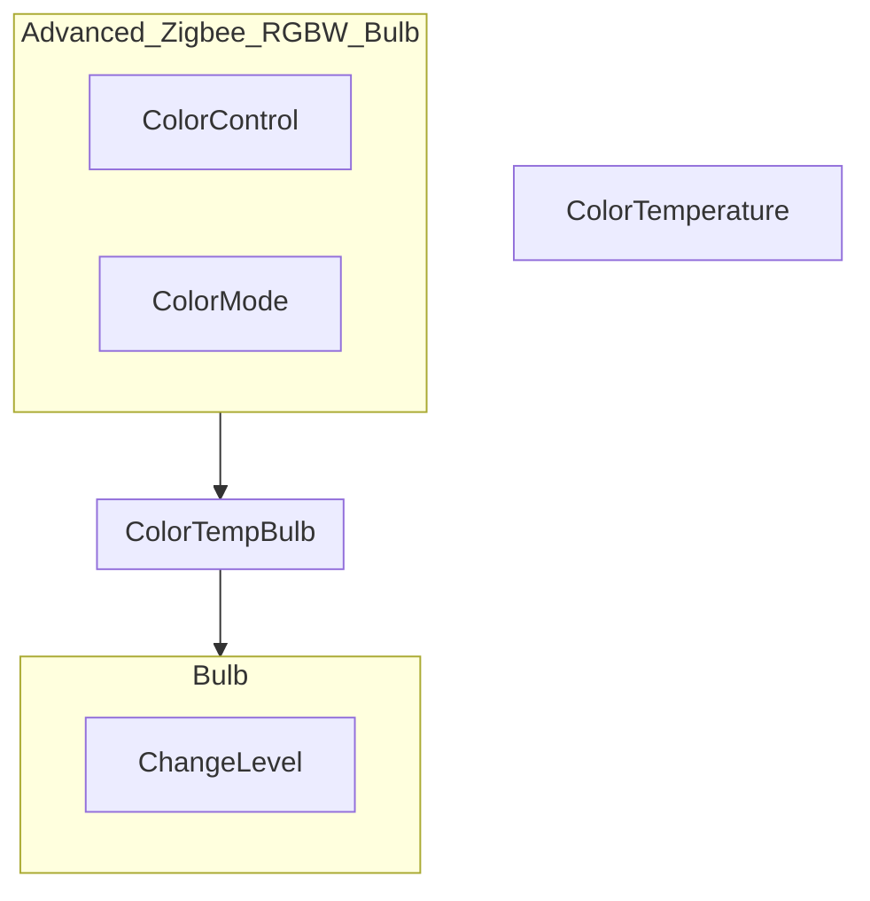
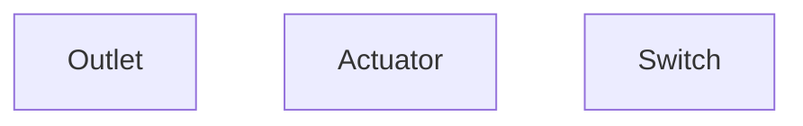

# Hubitat Elevation Maker API Interface

[](https://github.com/Jelloeater/hubitatcontrol/actions/workflows/test.yml)
[](https://github.com/Jelloeater/hubitatcontrol/actions/workflows/codeql.yml)
[](https://libraries.io/pypi/hubitatcontrol)


[](https://pypi.org/project/hubitatcontrol/)
[](https://github.com/Jelloeater/hubitatcontrol/blob/main/LICENSE)
[](https://www.python.org)

## Usage

```shell
pip install hubitatcontrol
```

**Or if you want a copy direct from source**

```shell
pip install git+https://github.com/Jelloeater/hubitatcontrol.git
```

```python
import hubitatcontrol as hc

hub = hc.get_hub(host='Hubitat_IP_or_Hostname', token='Maker_Token', app_id='Maker_App_ID')
device = hc.lookup_device(hub, 'Device_Name')

print(device.switch)
device.turn_on()
print(device.switch)
```

## Docs

[Located in /docs folder](docs)

You will need a .dot file browser for the class diagrams

## Roadmap

### v0.5

- [X] Advanced Zigbee RGBW Bulb

### v0.7

- [X] Generic Zigbee Outlet

### v0.8

- [X] Leviton DZ6HD Z-Wave Dimmer

### v1.0

- [ ] hueBridgeBulb

### v1.1

- [ ] hueBridgeBulbCT

### v1.2

- [ ] hueBridgeBulbRGBW

### v1.5

- [ ] Ecobee Thermostat

### v2.0

- [ ] Generic Z-Wave Lock

### v2.5

- [ ] Generic Z-Wave Plus Scene Switch

### v2.6

- [ ] Generic Zigbee Contact Sensor (no temp)
- [ ] Sonoff Zigbee Button Controller

## Structure

**Class Model**



**Capability Model**

*Bulb*



*Outlet*




## Development setup

Testing is done with PyTest, you will need to set up the correct env vars for your local (or cloud) Hubitat API
See `.env.example`

**Setup**

Install Go-Task --> <https://taskfile.dev/installation/>

```shell
task setup
task
```
