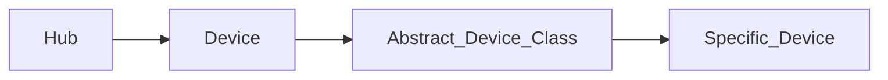

# Hubitat Control

Hubitat Elevation Maker API Interface (with Requests)

## Roadmap
### v0.5
- [ ] Advanced Zigbee RGBW Bulb
### v0.7
- [ ] Generic Zigbee Outlet
### v0.8
- [ ] Generic Z-Wave Plus Scene Switch
- [ ] Leviton DZ6HD Z-Wave Dimmer
### v1.0
- [ ] hueBridgeBulb
- [ ] hueBridgeBulbCT
- [ ] hueBridgeBulbRGBW
### v1.5
- [ ] Ecobee Thermostat
- [ ] Generic Z-Wave Lock
### v2.0
- [ ] Generic Zigbee Contact Sensor (no temp)
- [ ] Sonoff Zigbee Button Controller


## Development setup

- Need Python > 3.10 Installed

- Install Go-Task (<https://taskfile.dev/>)(Optional, it's NEAT!)
  - Linux (`sudo snap install task --classic`)

## Structure


## Test

```sh
task
```

## Usage
```python
from hubitatcontrol import *
h = get_hub(host='Hubitat_IP_or_Hostname', token='Maker_Token', app_id='Maker_App_ID')
d = lookup_device(h, 'Device_Name')
print(d.switch)
d.turn_on()
print(d.switch)
```
