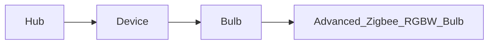

# Hubitat Control

Hubitat Elevation Maker API Interface (with Requests)

Please note, this is a WIP.

## Development setup

- Need Python > 3.10 Installed

- Install Go-Task (<https://taskfile.dev/>)(Optional, it's NEAT!)
  - Linux (`sudo snap install task --classic`)

## Structure



## TODO
- Advanced Zigbee RGBW Bulb
  - Add rest of bulb options
## Missing Devices
- Bulb
  - hueBridgeBulb
  - hueBridgeBulbCT
  - hueBridgeBulbRGBW
- Switch
  - Generic Z-Wave Plus Scene Switch
- Outlet
  - Generic Zigbee Outlet
- Thermostat
  - Ecobee Thermostat
- Door Lock
  - Generic Z-Wave Lock
- Dimmer
  - Leviton DZ6HD Z-Wave Dimmer
- Other Devices
  - Generic Zigbee Contact Sensor (no temp)
  - Sonoff Zigbee Button Controller
## Test

```sh
task test
```

**OR**

- `pip install pipenv`
- `pipenv install --dev`
- `pipenv run pytest --cov`

## Usage

- You will need to fill out the .env file for the API to work.

```python
from dotenv import load_dotenv
load_dotenv()
import hubitat-control as Hubitat

h = Hubitat.Hub()
d = h.get_device('Living Room')
test_bulb = Hubitat.Bulb(d)

test_bulb.turn_on()
assert test_bulb.switch == 'on'
```
