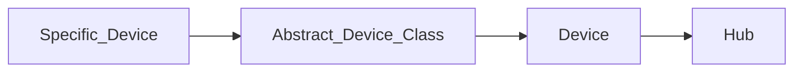

# Hubitat Elevation Maker API Interface

[](https://github.com/Jelloeater/hubitatcontrol/actions/workflows/test.yml)
[](https://github.com/Jelloeater/hubitatcontrol/actions/workflows/codeql.yml)
[](https://libraries.io/pypi/hubitatcontrol)


[](https://pypi.org/project/hubitatcontrol/)
[](https://github.com/Jelloeater/hubitatcontrol/blob/main/LICENSE)
[](https://www.python.org)

## Intro

This guide assumes you own a **Hubitat Elevation** home automation controller.

If you are interested in purchasing one, you can purchase a unit from the manufactures website at [hubitat.com](https://hubitat.com/products) or from [Amazon.com](https://www.amazon.com/Hubitat-Elevation-Home-Automation-Hub/dp/B07D19VVTX/)

## Setup

To get the required API keys, you will need to log in to your Hubitat admin interface.

See [Maker API Documentation](https://docs2.hubitat.com/en/apps/maker-api) for how to add the `MakerAPI` application and to generate new API keys

## Install

```shell
pip install hubitatcontrol
```

**Or if you want a copy direct from source**

```shell
pip install git+https://github.com/Jelloeater/hubitatcontrol.git
```

## Usage

```python
import hubitatcontrol as hc

hub = hc.get_hub(host='Hubitat_IP_or_Hostname', token='Maker_Token', app_id='Maker_App_ID')
device = hc.lookup_device(hub, 'Device_Name')

print(device.switch)
device.turn_on()
print(device.switch)
```

## Docs

[Located in /docs folder](docs)

You will need a .dot file browser for the class diagrams

## Roadmap

### v0.5.0

- [X] Advanced Zigbee RGBW Bulb

### v0.7.0

- [X] Generic Zigbee Outlet

### v0.8.0

- [X] Leviton DZ6HD Z-Wave Dimmer

### v1.0.0

- [X] hueBridgeBulb
- [X] hueBridgeBulbRGBW
- [X] hueBridgeBulbCT

### v1.1.0

- [ ] Ecobee Thermostat

### v1.1.1

- [ ] Generic Z-Wave Lock

### v1.1.2

- [ ] Generic Z-Wave Plus Scene Switch

### v1.1.3

- [ ] Generic Zigbee Contact Sensor (no temp)
- [ ] Sonoff Zigbee Button Controller

## Structure

**Class Model**



## Development setup

Testing is done with PyTest, you will need to set up the correct env vars for your local (or cloud) Hubitat API
See `.env.example`

If you are using a local API endpoint, please leave `HUBITAT_CLOUD_ID` blank in the `.env` file.

**Setup**

Install Go-Task --> <https://taskfile.dev/installation/>

```shell
task setup
task
```
