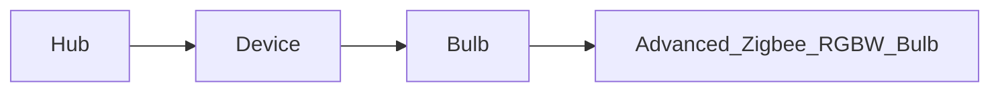

# Hubitat Control

Hubitat Elevation Maker API Interface (with Requests)

## Roadmap
### v0.5
- [ ] Advanced Zigbee RGBW Bulb
### v0.7
- [ ] Generic Zigbee Outlet
### v0.8
- [ ] Generic Z-Wave Plus Scene Switch
- [ ] Leviton DZ6HD Z-Wave Dimmer
### v1.0
- [ ] hueBridgeBulb
- [ ] hueBridgeBulbCT
- [ ] hueBridgeBulbRGBW
### v1.5
- [ ] Ecobee Thermostat
- [ ] Generic Z-Wave Lock
### v2.0
- [ ] Generic Zigbee Contact Sensor (no temp)
- [ ] Sonoff Zigbee Button Controller


## Development setup

- Need Python > 3.10 Installed

- Install Go-Task (<https://taskfile.dev/>)(Optional, it's NEAT!)
  - Linux (`sudo snap install task --classic`)

## Structure


## Test

```sh
task test
```

**OR**

- `pip install pipenv`
- `pipenv install --dev`
- `pipenv run pytest --cov`

## Usage

- You will need to fill out the .env file for the API to work.

```python
from dotenv import load_dotenv
load_dotenv()
import hubitat-control as Hubitat

h = Hubitat.Hub()
d = h.get_device('Living Room')
test_bulb = Hubitat.Bulb(d)

test_bulb.turn_on()
assert test_bulb.switch == 'on'
```
